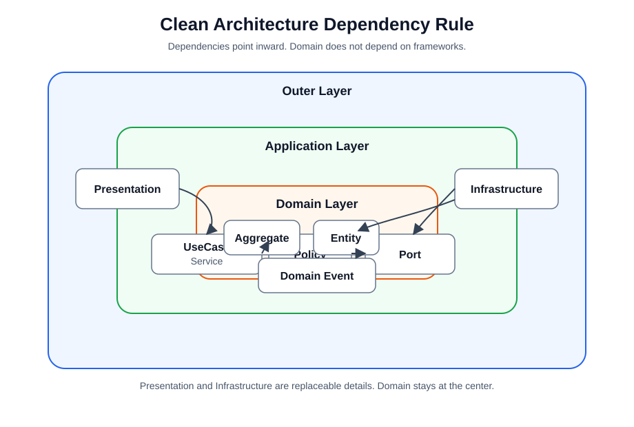
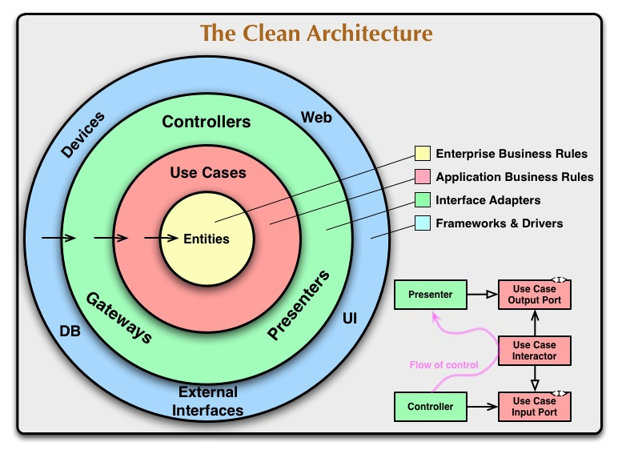
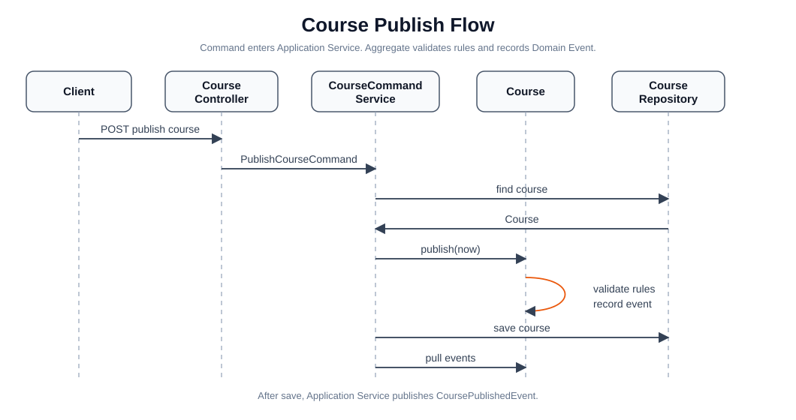
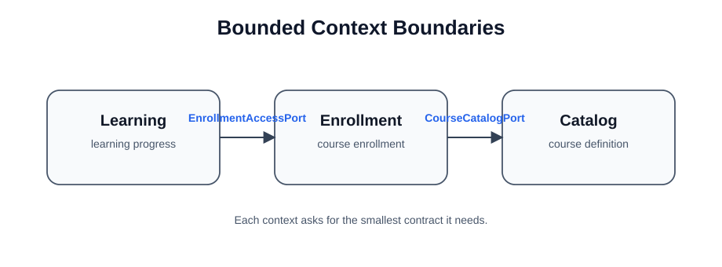
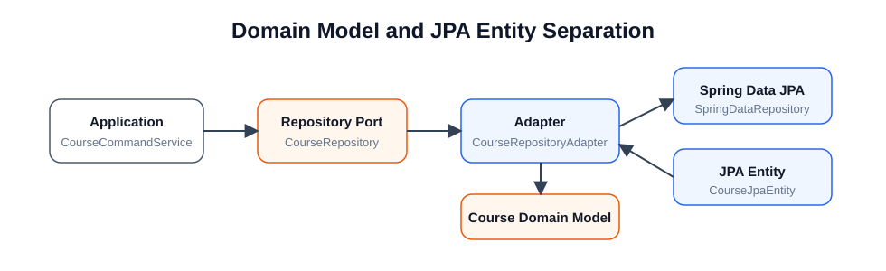
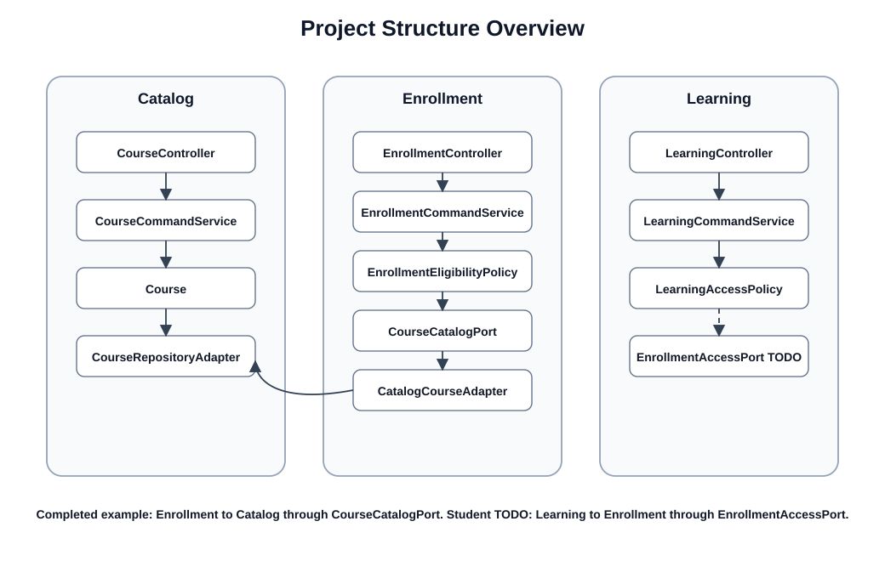

# Clean Architecture Lecture Notes

## 1. 왜 Clean Architecture를 설계하는가

Clean Architecture의 핵심 목적은 코드를 예쁘게 나누는 것이 아니다. 비즈니스 규칙을 오래 살아남게 만들고, 외부 기술 변화에 덜 흔들리게 만드는 것이다.

Spring Boot 프로젝트를 처음 만들면 Controller, Service, Repository, Entity를 빠르게 만들 수 있다. 이 구조는 작은 CRUD 프로젝트에서는 충분히 좋다. 하지만 시간이 지나면서 다음 문제가 생긴다.

- Controller에 검증과 비즈니스 판단이 섞인다.
- Service가 너무 커져서 모든 규칙이 한곳에 모인다.
- JPA Entity가 도메인 모델처럼 사용되면서 DB 구조가 곧 비즈니스 구조가 된다.
- MySQL, Spring Data JPA, HTTP API 구조가 바뀌면 핵심 규칙까지 같이 흔들린다.
- 테스트하려면 Spring Context와 DB가 거의 항상 필요해진다.

Clean Architecture는 이 문제를 줄이기 위해 코드의 중심을 바꾼다.

일반적인 웹 프로젝트는 바깥 기술에서 안쪽 비즈니스로 끌고 들어가는 느낌으로 작성된다.

```text
HTTP 요청 -> Controller -> Service -> Repository -> DB
```

Clean Architecture는 반대로 생각한다.

```text
비즈니스 규칙이 중심이고, HTTP/JPA/MySQL은 바깥쪽 도구다.
```

이 프로젝트에서 가장 중요한 기준은 다음이다.

> Domain과 Application은 Spring, JPA, MySQL, HTTP를 몰라도 이해될 수 있어야 한다.

## 2. 의존성 규칙

Clean Architecture의 가장 중요한 규칙은 의존성 방향이다.

바깥 계층은 안쪽 계층을 알아도 된다. 하지만 안쪽 계층은 바깥 계층을 알면 안 된다.




위 그림에서 핵심은 화살표가 안쪽을 향한다는 점이다.

- Controller는 UseCase를 호출한다.
- Application Service는 Aggregate를 사용한다.
- Infrastructure Adapter는 Port를 구현한다.
- Domain은 Controller, JPA Entity, Spring Event Publisher를 모른다.

이 규칙을 지키면 도메인 규칙은 특정 기술에 덜 묶인다.

## 3. 계층별 책임

이 프로젝트는 각 Bounded Context 안에서 다음 구조를 사용한다.

```text
catalog
 ├─ presentation
 ├─ application
 ├─ domain
 └─ infrastructure
```

### 3-1. Presentation 계층

Presentation 계층은 외부 요청을 애플리케이션 요청으로 번역한다.

예:

- HTTP JSON 요청을 받는다.
- Request DTO를 검증한다.
- Command를 만든다.
- UseCase를 호출한다.
- ApiResponse 형태로 응답한다.

Presentation 계층에 있어도 되는 것:

- `@RestController`
- `@RequestMapping`
- `@RequestBody`
- Request/Response DTO
- Swagger `@Operation`, `@Schema`

Presentation 계층에 있으면 안 되는 것:

- 강의를 공개할 수 있는지 판단하는 규칙
- 중복 수강 판단
- JPA Entity 직접 저장
- DB 조회 로직

예를 들어 `CourseController`는 `CreateCourseRequest`를 받아 `CreateCourseCommand`로 바꾼다. 하지만 “강의 제목이 비즈니스적으로 유효한가?”, “강의를 공개할 수 있는가?” 같은 판단은 Controller가 하지 않는다.

### 3-2. Application 계층

Application 계층은 하나의 사용자 시나리오를 조립한다.

예:

```text
강의 공개 UseCase
1. Course 조회
2. Course.publish() 호출
3. Course 저장
4. Domain Event 발행
```

Application Service는 흐름을 담당한다. 규칙을 직접 많이 가지면 안 된다.

좋은 예:

```java
Course course = getCourse(command.courseId());
course.publish(clock.instant());
courseRepository.save(course);
publishAll(course.pullDomainEvents());
```

나쁜 예:

```java
if (course.getSections().isEmpty()) {
    throw new DomainRuleViolationException("...");
}
if (course.getStatus() != CourseStatus.DRAFT) {
    throw new DomainRuleViolationException("...");
}
course.changeStatus(CourseStatus.PUBLISHED);
```

두 번째 예시는 공개 규칙이 Application Service로 새어 나온 것이다. 이런 규칙은 `Course.publish()` 안에 있어야 한다.

### 3-3. Domain 계층

Domain 계층은 핵심 비즈니스 규칙을 담는다.

이 프로젝트에서 `Course`는 `catalog` 컨텍스트의 Aggregate Root다.

`Course`가 책임지는 규칙:

- 강의 제목은 비어 있을 수 없다.
- 초안 상태에서만 섹션과 모듈을 추가할 수 있다.
- 같은 강의 안에서 섹션 순서는 중복될 수 없다.
- 공개하려면 최소 하나의 섹션과 최소 하나의 모듈이 필요하다.
- 공개에 성공하면 `CoursePublishedEvent`를 기록한다.

Domain 계층은 순수해야 한다.

Domain 계층이 알면 안 되는 것:

- `@Entity`
- `@Table`
- `JpaRepository`
- `HttpServletRequest`
- `ResponseEntity`
- `ApplicationEventPublisher`

Domain 계층이 이런 기술을 알게 되면 테스트가 어려워지고, 비즈니스 규칙이 기술 구조에 묶인다.

### 3-4. Infrastructure 계층

Infrastructure 계층은 기술 세부사항을 담당한다.

예:

- JPA Entity
- Spring Data Repository
- MySQL 매핑
- Domain Model과 JPA Entity 변환
- Spring Event Handler
- 다른 Bounded Context에 접근하는 Adapter

이 프로젝트의 예:

```text
CourseRepository        // domain port
CourseRepositoryAdapter // infrastructure adapter
SpringDataCourseRepository // Spring Data JPA
CourseJpaEntity         // DB 저장 모델
```

Application과 Domain은 `CourseJpaEntity`를 모른다. 대신 `CourseRepository`라는 추상 계약만 사용한다.

## 4. DDD와 Clean Architecture의 만나는 지점

Clean Architecture는 계층과 의존성 방향을 다룬다. DDD는 비즈니스 모델링을 다룬다.

둘은 다음처럼 연결된다.

| DDD 개념 | Clean Architecture 위치 | 프로젝트 예시 |
| --- | --- | --- |
| Bounded Context | 최상위 업무 패키지 | `catalog`, `enrollment`, `learning` |
| Aggregate | Domain | `Course`, `Enrollment`, `LearningProgress` |
| Domain Event | Domain | `CoursePublishedEvent` |
| Repository Port | Domain 또는 Application | `CourseRepository` |
| Application Service | Application | `CourseCommandService` |
| Adapter | Infrastructure | `CourseRepositoryAdapter` |

DDD 없이 Clean Architecture만 적용하면 패키지는 나뉘지만 비즈니스 의미가 약해질 수 있다.

Clean Architecture 없이 DDD만 적용하면 모델은 좋아 보여도 Spring/JPA/HTTP와 강하게 엉킬 수 있다.

이 프로젝트의 목표는 두 가지를 함께 적용하는 것이다.

## 5. EventStorming 결과를 코드로 옮기기

EventStorming에서는 보통 다음 요소가 나온다.

- Command: 사용자가 시스템에 요청하는 일
- Aggregate: 규칙을 지키며 상태를 바꾸는 대상
- Domain Event: 이미 발생한 중요한 결과
- Policy: 어떤 일이 발생했을 때 이어지는 판단 또는 반응

강의 공개 흐름을 예로 들면 다음과 같다.



이 흐름에서 역할은 명확하다.

- Controller는 HTTP 요청을 Command로 바꾼다.
- Application Service는 흐름을 조립한다.
- Course Aggregate는 공개 규칙을 판단한다.
- Domain Event는 공개가 성공했다는 결과를 표현한다.
- Event Handler는 후속 처리를 담당한다.

## 6. Command와 Domain Event의 차이

Command와 Domain Event는 이름이 비슷해 보일 수 있지만 의미가 완전히 다르다.

```text
Command      = 앞으로 해달라는 요청
Domain Event = 이미 일어난 결과
```

예:

| 구분 | 예시 | 의미 |
| --- | --- | --- |
| Command | `PublishCourseCommand` | 강의를 공개해 주세요 |
| Domain Event | `CoursePublishedEvent` | 강의가 공개되었습니다 |

Command는 실패할 수 있다. 강의에 모듈이 없으면 공개 요청은 실패한다.

Domain Event는 이미 성공한 결과다. `CoursePublishedEvent`가 발생했다면 강의는 이미 공개된 것이다.

따라서 Domain Event 이름은 과거형으로 짓는 것이 좋다.

좋은 이름:

- `CoursePublishedEvent`
- `EnrollmentCreatedEvent`
- `ModuleCompletedEvent`

피해야 할 이름:

- `PublishCourseEvent`
- `CreateEnrollmentEvent`
- `CompleteModuleEvent`

## 7. 모든 것을 Event로 만들지 않는다

EventStorming을 배우면 모든 상태 변경을 Event로 만들고 싶어질 수 있다. 하지만 모든 변경이 Domain Event는 아니다.

Domain Event로 만들기 좋은 경우:

- 다른 Bounded Context가 반응해야 한다.
- 알림, 통계, 검색 색인 갱신 같은 후속 작업이 붙을 수 있다.
- 도메인 전문가가 중요하게 말하는 업무 사건이다.
- 비동기 처리로 확장할 가능성이 있다.

Domain Event로 만들지 않아도 되는 경우:

- 내부 필드 하나가 임시로 계산되었다.
- 조회가 끝났다.
- 외부에서 반응할 필요가 없는 단순 편집이다.
- Aggregate 내부에서만 의미 있는 중간 단계다.

예를 들어 `CoursePublishedEvent`는 의미 있다. 강의 공개 후 수강 신청 가능 여부가 달라지고, 알림이나 검색 색인 갱신이 붙을 수 있기 때문이다.

반면 “섹션 제목을 임시로 바꿨다”는 현재 수업 범위에서는 Event로 만들 필요가 없다.

## 8. Bounded Context 경계

Bounded Context는 단순한 패키지 이름이 아니다. 같은 단어라도 컨텍스트마다 의미가 다를 수 있기 때문에 경계를 나눈다.

이 프로젝트에는 세 개의 주요 컨텍스트가 있다.



### catalog

`catalog`는 강의를 어떻게 구성하고 공개할지 다룬다.

관심사:

- 강의 생성
- 섹션 추가
- 모듈 추가
- 강의 공개

중심 Aggregate:

- `Course`

### enrollment

`enrollment`는 누가 어떤 강의를 수강하는지 다룬다.

관심사:

- 수강 신청
- 중복 수강 방지
- 수강 상태 관리

중심 Aggregate:

- `Enrollment`

`enrollment`는 `Course` 전체가 필요하지 않다. 수강 신청에 필요한 것은 “이 강의가 공개되었는가?”라는 사실이다.

그래서 `CourseCatalogPort`를 둔다.

### learning

`learning`은 사용자가 실제로 학습을 진행했는지 다룬다.

관심사:

- 학습 가능 여부 확인
- 모듈 완료 처리
- 학습 진행 상태 조회

중심 Aggregate:

- `LearningProgress`

`learning`은 `Enrollment` 전체가 필요하지 않다. 필요한 것은 “활성 수강이 있는가?”라는 사실이다.

그래서 실습 과제로 `EnrollmentAccessPort`를 제공한다.

## 9. 직접 의존과 Port

다른 Bounded Context를 호출하는 것 자체가 나쁜 것은 아니다. 문제는 상대 컨텍스트의 내부 모델에 직접 기대는 것이다.

나쁜 구조:

```text
EnrollmentCommandService -> catalog.domain.model.Course
```

이 구조에서는 `Course`의 필드나 규칙이 바뀌면 `enrollment`도 흔들린다.

더 나은 구조:

```text
EnrollmentEligibilityPolicy -> CourseCatalogPort -> CatalogCourseAdapter -> CourseRepository
```

`enrollment`는 자신에게 필요한 계약을 정의한다.

```java
public interface CourseCatalogPort {
    CoursePublicationStatus getPublicationStatus(Long courseId);
}
```

응답 모델도 작게 만든다.

```java
public record CoursePublicationStatus(
        Long courseId,
        boolean published
) {
}
```

이렇게 하면 `enrollment`는 `Course`의 제목, 설명, 섹션, 모듈 구조를 몰라도 된다.

수업에서 기억할 문장:

> 다른 컨텍스트를 호출할 수는 있다. 다만 상대 컨텍스트의 내부 모델이 아니라, 내 컨텍스트에 필요한 계약에 의존해야 한다.

## 10. Transaction 경계

트랜잭션은 단순히 DB 저장에 붙이는 어노테이션이 아니다. 하나의 UseCase를 어디까지 일관된 작업 단위로 볼 것인가를 표현한다.

이 프로젝트에서는 `@Transactional`을 Application Service에 둔다.

예:

```java
@Service
@Transactional
public class CourseCommandService {

    public void handle(PublishCourseCommand command) {
        Course course = getCourse(command.courseId());
        course.publish(clock.instant());
        courseRepository.save(course);
        publishAll(course.pullDomainEvents());
    }
}
```

왜 Controller가 아닌가?

Controller는 HTTP 요청과 응답을 다루는 어댑터다. 비즈니스 흐름의 일관성을 책임지는 곳이 아니다.

왜 Domain이 아닌가?

Domain은 DB commit, rollback, connection을 알면 안 된다. `Course.publish()`는 공개 규칙과 상태 변경만 알아야 한다.

왜 Application Service인가?

Application Service는 다음 흐름을 모두 알고 있다.

- 조회
- 도메인 행위 호출
- 저장
- 이벤트 발행

따라서 UseCase 단위의 트랜잭션 경계를 잡기에 적합하다.

## 11. Domain Model과 JPA Entity 분리

초보 개발자에게 가장 헷갈리는 부분 중 하나가 “왜 `Course`와 `CourseJpaEntity`를 따로 두는가?”이다.

이 둘은 목적이 다르다.

| 구분 | 목적 |
| --- | --- |
| `Course` | 강의 비즈니스 규칙을 표현 |
| `CourseJpaEntity` | DB 테이블에 저장하기 위한 매핑 표현 |

JPA Entity를 Domain Model로 그대로 사용하면 처음에는 편하다. 하지만 시간이 지나면 다음 문제가 생긴다.

- DB 컬럼 구조가 곧 도메인 구조가 된다.
- Lazy Loading, cascade, orphanRemoval 같은 JPA 관심사가 도메인 규칙과 섞인다.
- 단위 테스트가 어려워진다.
- 도메인 모델이 Spring/JPA 없이 이해되기 어렵다.

현재 프로젝트는 다음 구조를 사용한다.



`CourseRepositoryAdapter`는 두 모델 사이를 변환한다.

- DB에서 읽은 `CourseJpaEntity`를 `Course`로 복원한다.
- 저장할 때 `Course`의 상태를 `CourseJpaEntity`에 반영한다.

## 12. 외부 의존성 분리

외부 의존성이란 비즈니스 규칙 바깥에 있는 기술이다.

예:

- Spring MVC
- JPA
- MySQL
- Swagger
- Logging
- AOP
- Metrics
- 외부 API

이런 것들은 중요하지만 중심은 아니다. 중심은 업무 규칙이다.

외부 의존성을 분리하는 이유:

- 기술 교체가 쉬워진다.
- 테스트가 쉬워진다.
- 비즈니스 규칙을 읽기 쉬워진다.
- 장애 범위를 줄일 수 있다.
- 수업에서 “무엇이 핵심이고 무엇이 도구인지” 설명하기 쉽다.

예를 들어 Swagger는 API 문서화 기술이다. 그래서 Controller와 OpenAPI 설정에만 등장해야 한다. `Course`나 `CourseCommandService`가 Swagger를 알면 안 된다.

## 13. 확장성을 고려한 설계

확장성은 무조건 복잡한 구조를 만드는 것이 아니다. 변경이 자주 일어나는 부분과 오래 유지되어야 하는 부분을 분리하는 것이다.

이 프로젝트에서 확장 가능한 지점은 다음이다.

### 13-1. 새로운 후속 작업 추가

강의 공개 후 알림을 보내고 싶다면 `Course.publish()`를 수정하지 않는다.

`CoursePublishedEvent`를 처리하는 Handler를 추가한다.

```text
CoursePublishedEvent
    -> 알림 발송 Handler
    -> 검색 색인 갱신 Handler
    -> 통계 적재 Handler
```

### 13-2. 저장 기술 변경

MySQL에서 다른 DB로 바뀌어도 Domain Model은 그대로 둘 수 있다.

변경이 필요한 곳:

- Infrastructure Adapter
- JPA Entity 또는 새 저장 기술 매핑

변경이 적어야 하는 곳:

- `Course`
- `CourseCommandService`
- `PublishCourseCommand`

### 13-3. 다른 컨텍스트 연결 방식 변경

현재는 `CourseCatalogPort`를 같은 애플리케이션 내부 Adapter로 구현한다.

나중에 catalog가 별도 서비스가 되면 Adapter만 바뀔 수 있다.

```text
현재:
CourseCatalogPort -> CatalogCourseAdapter -> CourseRepository

미래:
CourseCatalogPort -> CatalogHttpClientAdapter -> catalog-service HTTP API
```

Application Policy는 그대로 둘 수 있다.

## 14. AOP, Filter, Metrics는 어디에 두는가

AOP, Filter, Metrics는 대부분 도메인 규칙이 아니라 관찰과 운영을 위한 횡단 관심사다.

추천 위치:

```text
global.infrastructure.aop
global.infrastructure.filter
global.infrastructure.metric
```

좋은 사용:

- UseCase 실행 시간 측정
- 요청/응답 로그
- 실패 횟수 기록
- Domain Event 기반 비즈니스 지표 기록

피해야 할 사용:

- AOP에서 수강 가능 여부 판단
- Filter에서 도메인 상태 변경
- Metric 코드 안에서 비즈니스 규칙 처리

수업에서 기억할 문장:

> AOP와 Filter는 흐름을 관찰할 수는 있지만, 도메인 규칙을 대신 판단하면 안 된다.

## 15. 프로젝트 구조 한눈에 보기



## 16. 핵심 학습 포인트

코드를 볼 때 다음 질문을 계속 던지면 Clean Architecture 감각을 잡기 쉽다.

1. 이 코드는 비즈니스 규칙인가, 기술 세부사항인가?
2. 이 코드는 안쪽 계층에 있어야 하는가, 바깥쪽 계층에 있어야 하는가?
3. 이 의존성은 안쪽으로 향하는가?
4. Controller가 너무 많은 일을 하고 있지는 않은가?
5. Application Service가 규칙을 직접 판단하고 있지는 않은가?
6. Domain Model이 Spring/JPA/HTTP를 알고 있지는 않은가?
7. 다른 Bounded Context의 내부 모델을 직접 가져오고 있지는 않은가?
8. 테스트하려면 반드시 DB와 Spring이 필요한 구조인가?

## 17. 최종 정리

Clean Architecture는 계층을 많이 만드는 설계가 아니다.

핵심은 다음이다.

- 업무 규칙을 중심에 둔다.
- 외부 기술을 바깥쪽으로 밀어낸다.
- 의존성은 안쪽으로 향하게 한다.
- UseCase는 Application Service가 조립한다.
- Aggregate는 비즈니스 규칙을 지킨다.
- Domain Event는 이미 발생한 중요한 결과를 표현한다.
- Bounded Context 사이에는 필요한 계약만 둔다.

이 프로젝트에서 가장 중요한 학습 흐름은 두 가지다.

```text
Course.publish()
-> Aggregate와 Domain Event 이해
```

```text
EnrollmentEligibilityPolicy -> CourseCatalogPort
-> Bounded Context 경계와 외부 의존성 분리 이해
```

이 두 흐름을 이해하면, 나머지 `EnrollmentCreatedEvent`, `ModuleCompletedEvent`, `EnrollmentAccessPort`는 같은 패턴으로 확장할 수 있다.
