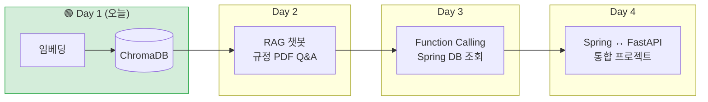
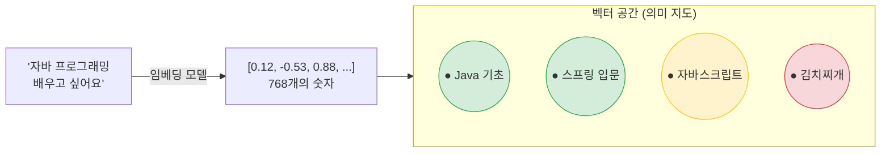
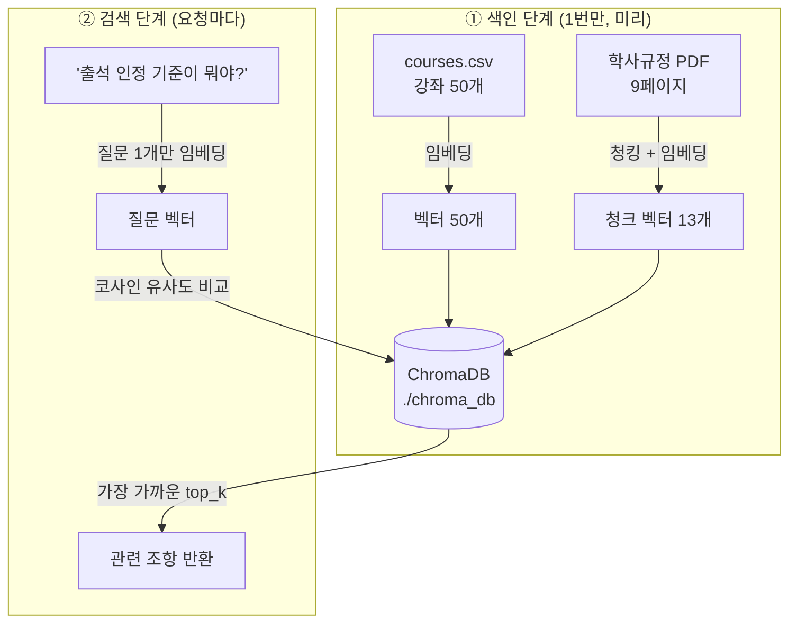
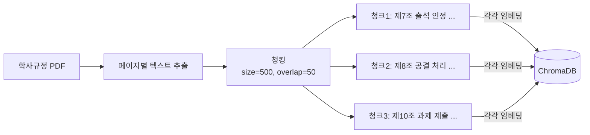

# Day 1 — Embedding + Vector DB

> **LMS AI 학습 도우미 만들기, 첫 번째 날.**
> 오늘은 "글자가 아니라 **의미**로 찾는 검색"을 만들고, 이를 기반으로 **강좌 추천 시스템 v1**과 **학사규정 검색 엔진**을 완성합니다.

---

## 1. 우리가 최종적으로 만들 것 (4일 로드맵)



오늘 만든 Vector DB가 **내일 RAG 챗봇의 검색 엔진**이 되고, 오늘 만든 추천 함수가 **Day 4 추천 챗봇의 심장**이 됩니다. 오늘 자료는 버리는 실습이 아니라 최종 프로젝트의 부품입니다.

---

## 2. 왜 임베딩인가 — LIKE 검색의 두 가지 실패

Spring 수업에서 검색을 이렇게 만들었습니다:

```sql
SELECT * FROM course WHERE title LIKE '%자바%';
```

이 검색은 두 가지 방식으로 실패합니다.

| 실패 유형 | 예시 | 이유 |
|---|---|---|
| **놓침** (False Negative) | "Java 기초 문법" 을 못 찾음 | 글자가 다르니까 |
| **오탐** (False Positive) | "자바스크립트 웹 개발" 을 잘못 찾음 | 글자만 겹치니까 |

**임베딩(Embedding)** 은 문장을 "의미 좌표"(숫자 벡터)로 바꾸는 기술입니다. 의미가 비슷한 문장은 벡터 공간에서 가까운 곳에 찍힙니다.



두 벡터가 얼마나 가까운지는 **코사인 유사도**(두 벡터가 이루는 각도, 1에 가까울수록 유사)로 측정합니다. → `01_embedding_basic.py` 에서 직접 확인합니다.

---

## 3. 왜 Vector DB인가 — "미리 계산해서 저장"

01 실습에서는 검색할 때마다 **모든 후보 문장을 다시 인코딩**합니다. 강좌가 5만 개라면 검색 한 번에 몇 분이 걸립니다.

**Vector DB** 는 벡터를 미리 계산해 저장해두는 데이터베이스입니다. 검색 시에는 **질문 1개만** 인코딩하면 됩니다.



| RDB (MySQL) 개념 | Vector DB (ChromaDB) 개념 |
|---|---|
| 테이블 (table) | 컬렉션 (collection) |
| PK | id |
| 일반 컬럼 | metadata |
| `WHERE category = '백엔드'` | `where={"category": "백엔드"}` |
| `LIKE '%자바%'` (글자 매칭) | `query()` (의미 매칭) |

---

## 4. 왜 청킹인가 — 긴 문서는 잘라서 넣는다

9페이지짜리 규정 PDF를 통째로 벡터 1개로 만들면, 온갖 주제가 섞여 "평균적인 의미"가 되어 검색이 망가집니다. 그래서 **주제 단위(약 500자)로 잘라서** 각각 임베딩합니다.



**overlap(겹침) 50자를 두는 이유**: 문장이 청크 경계에서 반토막 나면 어느 청크로도 검색되지 않습니다. 이웃 청크가 50자씩 겹치면 잘린 문장이 한쪽에는 온전히 남습니다.

```
청크 N   : ... 동영상 진도율이 90% 이상인 경우 해당 차시를 출석으로 ┃
청크 N+1 :                    ┃ 90% 이상인 경우 해당 차시를 출석으로 인정한다 ...
                              └──── 겹치는 구간 (안전장치) ────┘
```

---

## 5. 오늘의 실습 순서

| 순서 | 파일 | 만드는 것 | 핵심 개념 |
|---|---|---|---|
| 1교시 | (이론) | — | 임베딩, 코사인 유사도 |
| 2교시 | `01_embedding_basic.py` | 문장 → 벡터, 유사도 비교 | `SentenceTransformer.encode()` |
| 3교시 | `02_chromadb_basic.py` | 강좌 검색 + **추천 v1** | 컬렉션, upsert, query, where 필터 |
| 4교시 | `03_pdf_ingest.py` | 규정 PDF → Vector DB | PDF 추출, **청킹**, 출처 메타데이터 |
| 4교시 | `04_api_server.py` | FastAPI 서버로 공개 | lifespan, Pydantic ↔ Spring DTO |

### 폴더 구조

```
module01-embedding-vectordb/
├── README.md                        # 이 문서
├── requirements.txt
├── data/
│   ├── courses.csv                  # LMS 강좌 카탈로그 50개
│   └── lms_regulation.pdf           # 학사규정 (9페이지, 자체 제작)
├── 01_embedding_basic.py            # 임베딩 기초
├── 02_chromadb_basic.py             # Vector DB + 추천 v1
├── 03_pdf_ingest.py                 # PDF 청킹 & 색인
├── 04_api_server.py                 # FastAPI 서버
└── tools/
    └── generate_regulation_pdf.py   # (강사용) 규정 PDF 생성기
```

### 실행 방법

```bash
# 1. 가상환경 권장
python -m venv .venv
source .venv/bin/activate        # Windows: .venv\Scripts\activate

# 2. 의존성 설치
pip install -r requirements.txt

# 3. 순서대로 실행 (01 → 02 → 03 → 04)
python 01_embedding_basic.py     # 최초 실행 시 모델(~400MB) 다운로드
python 02_chromadb_basic.py      # ./chroma_db 폴더 생성됨
python 03_pdf_ingest.py

# 4. API 서버 실행 후 브라우저에서 Swagger UI 열기
uvicorn 04_api_server:app --reload --port 8000
# → http://localhost:8000/docs
```

---

## 6. 자주 발생하는 에러 FAQ

**Q1. 모델 다운로드가 멈춰 있어요 / 매우 느려요**
최초 1회 약 400MB를 받습니다. 강의장 공용 Wi-Fi에서는 오래 걸릴 수 있으니 수업 전 미리 `python 01_embedding_basic.py` 를 한 번 실행해 두세요. 받은 모델은 `~/.cache/huggingface` 에 캐시되어 다음부터는 즉시 로드됩니다.

**Q2. `04_api_server.py` 실행 시 검색 결과가 0건이에요**
02와 03을 먼저 실행해야 `./chroma_db` 에 데이터가 들어갑니다. `/health` 로 counts를 확인하세요. 또한 **터미널의 현재 위치가 모듈 폴더**여야 같은 `./chroma_db` 를 바라봅니다.

**Q3. 컬렉션에 데이터가 두 배로 늘어났어요**
`add()` 는 같은 id로 넣으면 에러/중복이 나지만 우리는 `upsert()` 를 씁니다. 그래도 이상하면 `./chroma_db` 폴더를 삭제하고 02, 03을 다시 실행하세요 (RDB 초기화와 동일한 감각).

**Q4. `sqlite3` 버전 에러가 나요 (일부 리눅스)**
ChromaDB는 sqlite 3.35 이상이 필요합니다. `pip install pysqlite3-binary` 후 [ChromaDB 문서의 sqlite 우회 방법](https://docs.trychroma.com/troubleshooting#sqlite)을 적용하세요.

**Q5. 검색 결과 유사도가 생각보다 낮게 나와요**
정상입니다. 유사도의 절대값보다 **후보들 사이의 상대 순위**가 중요합니다. 모델이 바뀌면 점수 분포 자체가 달라지므로, threshold를 정할 때는 반드시 실제 데이터로 실험해서 정합니다 (03 실습 2 참고).

---

## 7. 체크포인트 (오늘 수업을 이해했다면 답할 수 있어야 합니다)

1. `LIKE '%자바%'` 검색과 임베딩 검색의 차이를 "놓침"과 "오탐" 두 단어를 사용해 설명해 보세요.
2. 강좌 5만 개 서비스에서 Vector DB 없이 검색하면 왜 느린가요? Vector DB는 이 문제를 어떻게 해결하나요?
3. 청킹할 때 overlap을 0으로 하면 어떤 문제가 생기나요? 반대로 chunk_size를 5000자로 하면요?

---

## 8. 내일 예고 (Day 2 — RAG)

오늘 `POST /docs/search` 는 질문과 관련된 규정 조항을 **찾아주기만** 합니다. 내일은 여기에 단 한 단계를 추가합니다:

> 찾은 조항을 Gemini에게 주면서 — **"이 내용을 근거로 답변해줘"**

이것이 RAG(검색 증강 생성)의 전부입니다. 오늘 여러분은 이미 RAG의 절반(R, Retrieval)을 완성했습니다.
