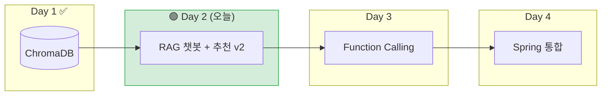
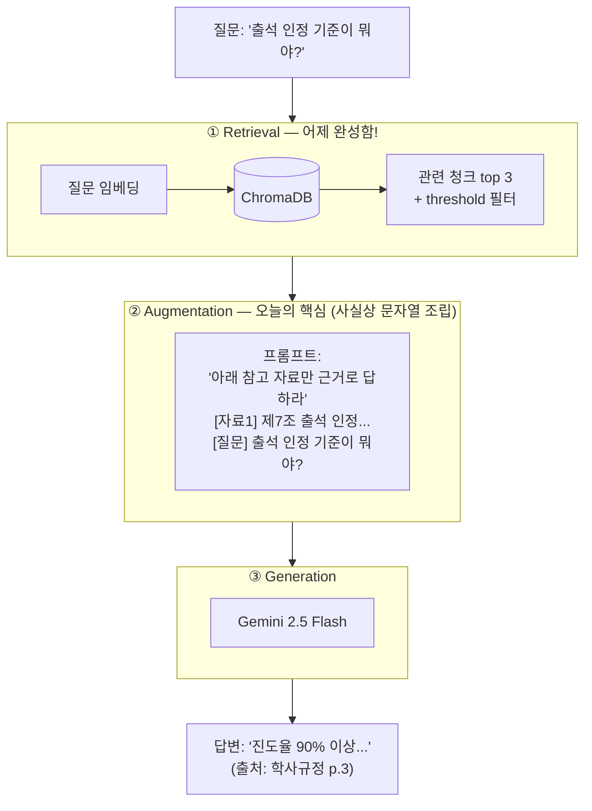
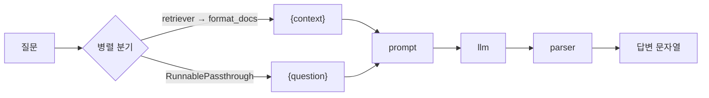
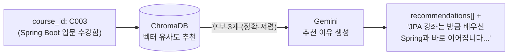

# Day 2 — RAG + LangChain with Gemini

> **어제 만든 검색 엔진에 '입'을 달아주는 날.**
> 어제 `POST /docs/search`는 규정 조항을 찾아주기만 했습니다. 오늘은 찾은 조항을 Gemini에게 건네며 *"이걸 근거로 답해줘"* 라고 시킵니다. 이것이 RAG의 전부입니다.

---

## 1. 오늘 위치 (4일 로드맵)



---

## 2. 왜 RAG인가 — 환각(Hallucination) 문제

Gemini는 똑똑하지만 **우리 학원의 학사규정을 본 적이 없습니다.** 그런데 물어보면? 아는 척하며 그럴듯한 답을 **지어냅니다.** (`01_gemini_basic.py` 마지막 데모에서 직접 목격합니다)

| | RAG 없이 | RAG 적용 |
|---|---|---|
| 질문 | "출석 인정 기준이 뭐야?" | "출석 인정 기준이 뭐야?" |
| 모델이 아는 것 | 일반 상식뿐 | **+ 학사규정 제7조 원문** |
| 답변 | "보통 80% 이상이면..." (지어냄) | "진도율 **90% 이상** (출처: p.3)" |

**RAG(Retrieval-Augmented Generation)** = 답변 전에 관련 문서를 **검색(R)** 해서 프롬프트에 **증강(A)** 한 뒤 **생성(G)** 하는 기법. 모델을 재학습시키지 않고도 우리 데이터로 답하게 만드는, 현재 가장 실용적인 방법입니다.



### 프롬프트 설계 3원칙 (RAG 품질의 8할)

1. **근거 제한** — "참고 자료에 있는 내용만으로 답하라" → 환각 차단
2. **탈출구 제공** — "모르면 모른다고 답하라" → 탈출구가 없으면 모델은 지어낸다
3. **출처 표기 요구** — "(출처: p.N)을 붙여라" → 사용자가 검증 가능

추가 방어선: **threshold** — 검색 유사도가 기준 미만이면 LLM을 호출조차 하지 않습니다 (비용 절약 + 환각 원천 차단).

---

## 3. 순수 구현 → LangChain: 무엇이 달라지나

원리를 알기 위해 **먼저 LangChain 없이** 만들고(`02`), 그 다음 LangChain으로 리팩토링합니다(`03`). 두 파일은 같은 일을 합니다.

| 02_rag_pure.py (직접 구현) | 03_rag_langchain.py (LCEL) | 역할 |
|---|---|---|
| `retrieve()` 함수 | `retriever` | ① 검색 |
| `build_prompt()` f-string | `ChatPromptTemplate` | ② 증강 |
| `generate()` + `genai.Client` | `ChatGoogleGenerativeAI` | ③ 생성 |
| `rag_answer()` 순서 호출 | `chain = A \| B \| C` | 조립 |
| `response.text` | `StrOutputParser` | 출력 정리 |



**프레임워크의 값어치**는 03의 스트리밍 데모에서 체감됩니다: `invoke()`를 `stream()`으로 바꾸는 것만으로 스트리밍이 됩니다. 02에서라면 `generate()`를 뜯어고쳐야 했습니다. (JDBC를 알고 JPA를 쓰는 개발자 vs 모르고 쓰는 개발자의 차이를 기억하세요 — LangChain도 같습니다.)

---

## 4. 오늘의 실습 순서

| 순서 | 파일 | 만드는 것 | 핵심 개념 |
|---|---|---|---|
| 준비 | `00_ingest.py` | Vector DB 재구축 (Day 1 복습) | — |
| 1교시 | `01_gemini_basic.py` | Gemini 첫 호출 | .env 키 관리, 시스템 프롬프트, temperature, 스트리밍, **환각 목격** |
| 2교시 | `02_rag_pure.py` | 순수 RAG | 검색→증강→생성, 프롬프트 3원칙, threshold |
| 3교시 | `03_rag_langchain.py` | LCEL 리팩토링 | Retriever, PromptTemplate, 파이프(\|) 조립 |
| 4교시 | `04_rag_api.py` | **RAG 챗봇 API + 추천 v2** | 멀티턴(history), 출처 반환, 무상태 설계 |

### 폴더 구조

```
module02-rag-langchain/
├── README.md
├── requirements.txt
├── .env.example          # 복사해서 .env 생성 후 키 입력
├── .gitignore            # .env 커밋 방지!
├── data/                 # Day 1과 동일한 데이터 (자기완결용)
│   ├── courses.csv
│   └── lms_regulation.pdf
├── 00_ingest.py          # Vector DB 준비 (1번만 실행)
├── 01_gemini_basic.py
├── 02_rag_pure.py
├── 03_rag_langchain.py
└── 04_rag_api.py
```

### 실행 방법

```bash
pip install -r requirements.txt

# 1. API 키 설정 (강사 안내에 따라 발급)
cp .env.example .env      # 그리고 .env 에 실제 키 입력

# 2. Vector DB 준비 (1번만)
python 00_ingest.py

# 3. 순서대로 실습
python 01_gemini_basic.py
python 02_rag_pure.py
python 03_rag_langchain.py

# 4. API 서버
uvicorn 04_rag_api:app --reload --port 8000
# → http://localhost:8000/docs
```

---

## 5. ⚠️ API Key 관리 수칙 (유료 계정 — 전원 필독)

우리 실습 계정은 **유료 결제가 연결된** Google AI Studio 계정입니다. 무료 티어의 분당 요청 제한 없이 전원이 동시 실습할 수 있는 대신, 아래를 반드시 지킵니다.

1. **키는 `.env`에만.** 소스코드, 채팅방, 스크린샷, git 커밋 어디에도 키가 노출되면 안 됩니다. 유출된 키로 발생한 사용량은 그대로 요금이 됩니다.
2. **커밋 전 확인.** `.gitignore`에 `.env`가 있는지 확인하고, `git status`에 `.env`가 보이면 커밋 금지. 이미 커밋했다면 즉시 강사에게 알리고 키를 폐기/재발급합니다.
3. **반복문 안에서 LLM 호출 금지.** 호출 1번 = 돈입니다. 특히 `while True` 안의 호출, 대량 데이터 순회 호출은 강사 확인 후 실행합니다.
4. **기본 모델은 `gemini-2.5-flash`.** `pro`는 필요할 때만 (비용 수 배 차이). 토큰 사용량은 `response.usage_metadata`로 확인하는 습관을 들입니다 (01 실습 3).
5. 사용량은 Google AI Studio / Cloud Console 대시보드에서 강사가 모니터링합니다.

---

## 6. API 명세 (Day 3 'Spring 계약서'의 초안)

### POST /chat/rag

```jsonc
// 요청 — history는 클라이언트(나중엔 Spring)가 보관해서 매번 보낸다
{
  "question": "그럼 지각 제출하면 어떻게 되나요?",
  "history": [
    {"role": "user",      "content": "과제 제출 규정 알려줘"},
    {"role": "assistant", "content": "과제는 마감일시까지..."}
  ]
}
// 응답
{
  "answer": "지각 제출은 마감 후 72시간까지 허용되며... (출처: 학사규정 p.4)",
  "sources": [
    {"page": 4, "snippet": "제10조 (과제 제출) ...", "similarity": 0.7213}
  ]
}
```

**서버가 대화 이력을 저장하지 않는 이유(무상태 설계):** Day 4에서 로그인·세션의 주인은 Spring입니다. "상태는 Spring이, AI 연산은 FastAPI가" 맡도록 나누면 FastAPI를 여러 대로 늘려도 문제가 없습니다.

### POST /courses/recommend/explain — 추천 시스템 v2



검색은 Vector DB가 (빠르고 저렴하게), 설득은 LLM이 (자연스럽게) — **역할 분담**이 핵심입니다. Day 1 추천 v1의 "숫자만 덜렁" 문제를 이렇게 해결합니다.

---

## 7. 자주 발생하는 에러 FAQ

**Q1. `400 API key not valid` 에러**
`.env`의 키에 공백/따옴표가 섞여 있지 않은지 확인하세요. `GOOGLE_API_KEY=AIza...` 형식으로 등호 뒤에 바로 붙여 씁니다. 파일 이름이 `.env.example`인 채로 두면 로드되지 않습니다.

**Q2. `429 RESOURCE_EXHAUSTED` 에러**
유료 계정이라 드물지만, 짧은 시간에 과도한 호출(반복문!)이 있으면 발생할 수 있습니다. 코드를 멈추고 강사에게 알려주세요.

**Q3. 02/03/04에서 검색 결과가 항상 비어 있어요**
`00_ingest.py`를 먼저 실행했는지, 그리고 **모듈 폴더에서** 실행하는지 확인하세요 (`./chroma_db` 상대경로).

**Q4. 답변이 매번 조금씩 달라요**
temperature가 0이어도 LLM 출력은 완전히 동일하지 않을 수 있습니다. RAG에서는 '출처 페이지가 정확한가'로 품질을 판단하세요.

**Q5. `Chroma`에서 임베딩 차원 불일치 에러**
색인 때와 다른 임베딩 모델로 접속하면 발생합니다. 모든 파일의 `MODEL_NAME`이 같은지 확인하고, 의심되면 `chroma_db` 폴더 삭제 후 `00_ingest.py` 재실행.

---

## 8. 체크포인트

1. 같은 모델·같은 질문인데 01에서는 틀리고 02에서는 맞았습니다. 정확히 무엇 하나가 달라졌기 때문인가요?
2. threshold 검사에 걸리면 LLM을 호출하지 않고 반려합니다. 이 설계가 주는 이점 **두 가지**는 무엇인가요?
3. `/chat/rag`에서 대화 이력을 서버가 아니라 클라이언트가 보관하게 한 이유를 Day 4 아키텍처와 연결해 설명해 보세요.

---

## 9. 내일 예고 (Day 3 — Function Calling)

오늘 챗봇은 "출석 기준이 뭐야?"(규정 문서)에는 답하지만, **"'내' 출석률은 몇 %야?"** 에는 답할 수 없습니다. 그 답은 PDF가 아니라 **Spring의 DB** 안에 있기 때문입니다.

내일은 Gemini에게 도구(함수)를 쥐여줍니다. 모델이 스스로 판단해서 *"get_my_attendance 함수를 실행해줘"* 라고 요청하면, 우리 서버가 Spring API를 호출해 결과를 다시 모델에게 넘겨 답변을 완성합니다. — LLM이 우리 시스템의 '손발'을 갖게 되는 날입니다.
