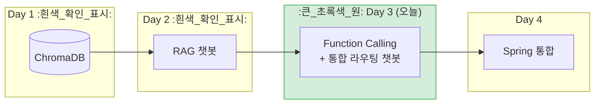
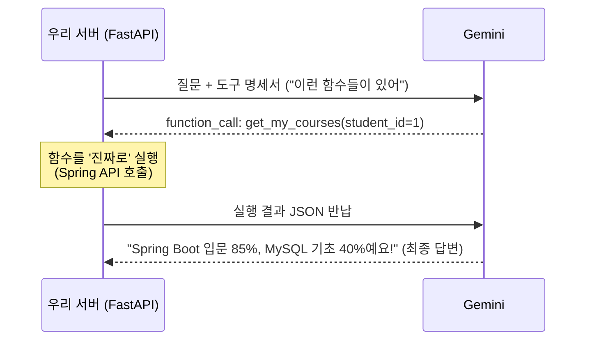
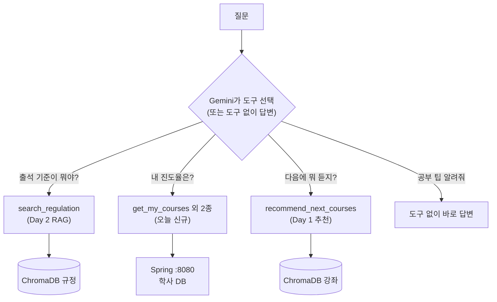
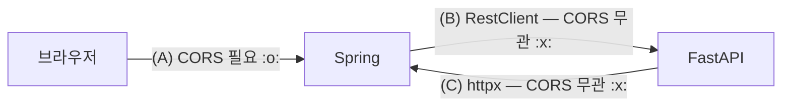

# Day 3 — Function Calling + Spring 연동 설계

> **챗봇에게 '손발'을 달아주는 날.**
> 어제까지의 챗봇은 "출석 기준이 뭐야?"(문서)에는 답해도 **"'내' 진도율은?"** 에는 답할 수 없었습니다. 그 답은 PDF가 아니라 **Spring의 DB** 안에 있기 때문입니다. 오늘 Gemini에게 함수(도구)를 쥐여주고, 마지막에는 RAG·DB조회·추천을 **하나의 챗봇**으로 합칩니다.

---

## 1. 오늘 위치 (4일 로드맵)



---

## 2. 핵심 개념: Function Calling 루프

시작 전에 가장 중요한 오해부터 깨야 합니다.

> ★ **LLM은 함수를 실행하지 않는다. 실행해 달라고 '요청'할 뿐이다.** ★

모델은 인터넷도 DB도 만질 수 없습니다. 모델이 할 수 있는 건 "이 함수를 이 인자로 실행해줘"라는 **JSON을 출력**하는 것뿐이고, 실행은 **우리 서버**가 합니다.



이 **[요청 → 실행 → 반납 → 답변]** 루프를 `01`에서 손으로 직접 돌리고(원리), `02`부터는 SDK 자동 모드에 맡깁니다(생산성). RAG를 순수 구현 → LangChain 순서로 배운 것과 같은 이유입니다.

**모델은 코드를 못 봅니다. '설명(description/docstring)'만 보고 함수를 고릅니다.** 그래서 도구 설명은 코드가 아니라 프롬프트입니다 — 라우팅 품질의 8할이 여기서 갈립니다 (01 실습 2, 03 실습 2에서 직접 망가뜨려 봅니다).

---

## 3. 최종 그림: 도구 5개를 든 라우팅 챗봇 (03)

비결: **RAG 검색조차 하나의 '도구'로 만들어 버리는 것.** 그러면 질문마다 어떤 능력을 쓸지 모델이 스스로 판단합니다.



| 질문 | used_tools (응답에 포함됨) |
|---|---|
| "출석 인정 기준이 뭐야?" | `["search_regulation"]` |
| "내 진도율 알려줘" | `["get_my_courses"]` |
| "다음 학기에 뭐 들으면 좋을까?" | `["get_my_courses", "recommend_next_courses"]` — **조합!** |
| "꾸준히 공부하는 팁" | `[]` |

---

## 4. 오늘의 실습 순서

| 순서 | 파일 | 만드는 것 | 핵심 개념 |
|---|---|---|---|
| 준비 | `00_ingest.py` | Vector DB (Day 1~2와 동일) | — |
| 1교시 | `01_fc_basic.py` | mock 함수 FC | **수동 루프**, 도구 명세, 자동 모드 |
| 2교시 | `02_fc_spring.py` | **진짜 Spring API 연동** | httpx, 타임아웃, 에러의 데이터화 |
| 3교시 | `docs/api-contract.md` | **API 계약서** (코드 아님!) | snake_case 통일, 타임아웃 합의, 에러 규격 |
| 4교시 | `03_router_chat_api.py` | 통합 라우팅 챗봇 `/chat` | RAG도 도구다, LLM 라우팅 |

`01→02`에서 함수의 **시그니처는 그대로 두고 몸통만** mock→실제로 갈아끼웁니다. "인터페이스 먼저"를 몸으로 익히는 장치입니다.

### 실행 방법 — 오늘부터 서버가 2개!

```bash
# ── 터미널 1: Spring (lms-spring-skeleton 폴더에서) ──
./gradlew bootRun
# 확인: localhost/api/students/1/courses

# ── 터미널 2: FastAPI (이 폴더에서) ──
pip install -r requirements.txt
cp .env.example .env        # Day 2와 동일하게 키 입력
python 00_ingest.py         # 1번만
python 01_fc_basic.py       # Spring 없이도 동작 (mock)
python 02_fc_spring.py      # ★ Spring이 떠 있어야 함
uvicorn 03_router_chat_api:app --reload --port 8000
# → localhost/docs 에서 /chat 테스트
```

### 폴더 구조

```
module03-function-calling/
├── README.md
├── requirements.txt / .env.example / .gitignore
├── data/                     # Day 1~2와 동일
├── docs/
│   └── api-contract.md       # ★ 3교시 산출물이자 Day 4의 기준 문서
├── 00_ingest.py
├── 01_fc_basic.py            # mock + 수동 루프
├── 02_fc_spring.py           # 실제 Spring 연동
└── 03_router_chat_api.py     # 통합 /chat

lms-spring-skeleton/          # ★ 별도 배포 — 해당 README 참고
```

---

## 5. CORS와 RestClient — 오늘 꼭 정리할 두 가지

**CORS는 '브라우저'의 보안 정책입니다.** 우리 시스템의 세 구간 중 CORS가 관여하는 곳은 단 하나입니다.



서버 프로세스(RestClient, httpx, curl, Postman)는 브라우저가 아니므로 CORS 규칙 자체가 없습니다. "RestClient가 CORS에 막혔다"는 진단은 100% 오진입니다. 상세 설명은 Spring 프로젝트의 `CorsConfig.java` 주석에 있습니다.

**RestClient에서 신경쓸 것** (상세는 `RestClientConfig.java` / `AiClientService.java` 주석): 타임아웃 필수 명시(미설정 시 톰캣 스레드 고갈 → 전체 장애), **LLM이라 read 타임아웃 60초**(일반 API 감각으로 5초 주면 정상 응답도 끊김), 자동구성 Builder 주입(snake_case 직렬화 유지), 에러의 두 종류 구분(4xx/5xx 응답 vs 연결 실패), LLM 호출에 무분별한 재시도 금지(비용+대기시간).

---

## 6. 자주 발생하는 에러 FAQ

**Q1. `02` 실행 시 "학사 정보 서버(Spring)에 연결할 수 없습니다"**
정상적인 에러 처리가 동작한 것입니다(챗봇이 죽지 않죠!). Spring 서버(`./gradlew bootRun`)를 먼저 띄우세요. 8080 포트를 다른 프로세스가 쓰고 있다면 `application.yml`의 `server.port`와 `SPRING_BASE_URL` 환경변수를 함께 바꿉니다.

**Q2. 모델이 함수를 호출하지 않고 "정보가 없다"고 답해요**
도구 설명(docstring)이 질문과 연결되지 않는 경우입니다. docstring에 사용 상황("'과제', '마감' 질문에 사용")을 구체적으로 적으세요. temperature가 높아도 라우팅이 흔들립니다(0.2 권장).

**Q3. 모델이 같은 함수를 계속 반복 호출해요**
함수가 에러 dict를 반환할 때 모델이 재시도하는 경우가 있습니다. 수동 루프(01)에는 5회 안전장치가 있고, 자동 모드도 SDK 기본 상한이 있습니다. 에러 메시지에 "재시도해도 소용없음"을 명시하면 개선됩니다.

**Q4. Spring 응답의 필드가 camelCase로 나와요**
`application.yml`의 `spring.jackson.property-naming-strategy: SNAKE_CASE`가 있는지 확인하세요. 계약서 2장 위반이면 FastAPI가 422를 냅니다.

**Q5. `data.sql`의 과제가 조회되지 않아요**
`DATEADD`는 H2 문법입니다. MySQL로 전환했다면 `DATE_ADD(CURDATE(), INTERVAL 3 DAY)`로 바꿔야 합니다 (data.sql 상단 주석).

---

## 7. 체크포인트

1. "LLM이 함수를 실행한다"는 문장은 왜 틀렸나요? 실제로 일어나는 일을 [요청→실행→반납→답변] 루프로 설명해 보세요.
2. Spring이 죽어 있어도 챗봇은 죽지 않습니다. FastAPI 쪽(`_spring_get`)과 Spring 쪽(`AiClientService`)에서 각각 어떤 장치가 이를 보장하나요? 두 장치의 공통 철학은?
3. 세 구간 (A)(B)(C) 중 CORS 설정이 필요한 곳은 어디이고, 나머지에 필요 없는 이유는 무엇인가요?

---

## 8. 내일 예고 (Day 4 — 통합)

부품이 모두 준비됐습니다: FastAPI `/chat`(오늘), Spring `AiClientService`·`ChatController`(오늘 배포한 스켈레톤에 이미 탑재!), API 계약서(오늘 3교시).

내일은 **브라우저 챗봇 화면**을 붙여 [브라우저 → Spring → FastAPI → Gemini ⇄ Spring DB] 전 구간을 관통시키고, 시나리오 3종(규정 질문 / 내 데이터 / 추천)을 팀별로 시연합니다. 여러분이 CORS 에러를 처음 만나는 순간도 아마 내일입니다 — 이제 왜 나는지, 어디를 고쳐야 하는지 알고 있을 겁니다.