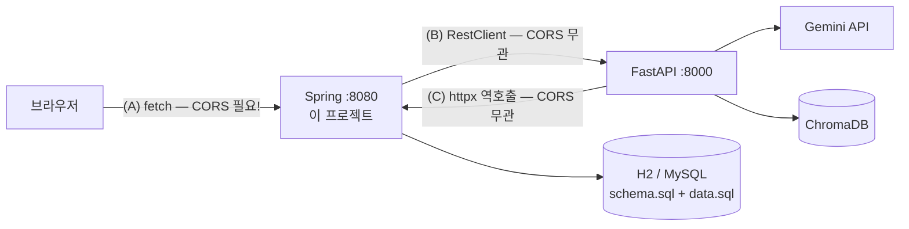

# LMS Spring 스켈레톤 (수강생 배포용)

> Day 3~4 실습에서 **FastAPI(AI 서버)의 짝**이 되는 Spring 프로젝트입니다.
> 회원/강좌/과제 조회 기능은 **완성**되어 있고, 여러분은 AI 연동 부분에 집중합니다.
> 인증/인가는 범위에서 제외했으며, 로그인 학생은 **ID 1(김민준)로 하드코딩**되어 있습니다 (`ChatController.DEMO_STUDENT_ID`).

---

## 1. 전체 구조에서 이 프로젝트의 위치



| 패키지 | 역할 | 상태 |
|---|---|---|
| `domain`, `repository` | 학생/강좌/수강/과제/제출 엔티티와 조회 | ✅ 완성 |
| `service`, `controller` | FastAPI가 역호출(C)하는 조회 API 3개 | ✅ 완성 |
| `config.CorsConfig` | 브라우저(A) 구간 CORS 허용 | ✅ 완성 (주석 필독!) |
| `config.RestClientConfig` | FastAPI 호출(B)용 클라이언트 설정 | ✅ 완성 (주석 필독!) |
| `ai.AiClientService` | FastAPI `/chat` 호출 + 장애 격리 | ✅ 완성 (Day 4에 심화 TODO) |
| `ai.ChatController` | 브라우저용 `/chat` + 학생 ID 주입 | ✅ 완성 |

## 2. 실행 방법

```bash
./gradlew bootRun          # Windows: gradlew.bat bootRun
```

별도 DB 설치가 필요 없습니다. **H2 인메모리 DB**가 뜨면서 `schema.sql`(스키마) → `data.sql`(더미데이터)이 자동 적재됩니다. 서버를 재시작하면 데이터가 초기화되므로 실습 중 마음껏 망가뜨려도 됩니다. MySQL로 전환하려면 `application.yml`의 주석을 참고하세요 (`data.sql`의 `DATEADD`는 MySQL에선 `DATE_ADD(CURDATE(), INTERVAL n DAY)`로 변경).

### 실행 확인 체크리스트

1. `http://localhost:8080/api/students/1/courses` → 김민준의 수강 3건 JSON (필드가 `progress_rate`처럼 **snake_case**인지 확인 — API 계약서 2장)
2. `http://localhost:8080/api/students/1/assignments/upcoming?days=7` → 미제출 과제 2건 (마감일이 항상 "며칠 뒤"인 이유는 `data.sql`의 상대 날짜 주석 참고)
3. `http://localhost:8080/api/students/99/summary` → `404` + `{"detail": "학생을 찾을 수 없습니다: 99"}`
4. `http://localhost:8080/h2-console` → JDBC URL `jdbc:h2:mem:lmsdb` 로 접속해 테이블 확인

## 3. 꼭 읽어야 할 주석 2곳 (시험에 나옵니다)

**`CorsConfig.java`** — CORS는 **브라우저에만** 적용되는 정책입니다. "Spring→FastAPI RestClient 호출이 CORS에 막혔다"는 진단은 100% 오진인 이유, preflight(OPTIONS)의 동작, `allowedOrigins`에 `*`를 쓰면 안 되는 이유가 정리되어 있습니다.

**`RestClientConfig.java`** — 타임아웃 미설정이 톰캣 스레드 고갈 → 전체 장애로 번지는 시나리오, **LLM이라 read 타임아웃을 60초로 길게 잡는 이유**, `RestClient.create()` 대신 자동구성 `Builder`를 주입받아야 snake_case 설정을 잃지 않는 이유, LLM 호출에 재시도를 함부로 넣으면 안 되는 이유가 정리되어 있습니다.

## 4. 데이터 시나리오 (data.sql)

| 학생 | 용도 |
|---|---|
| 1 김민준 | 데모 주인공. Java 기초 수료, Spring Boot 입문 85%, 미제출 과제 2건이 며칠 뒤 마감 |
| 2 이서연 | 실습용 (데이터·AI 트랙) — 학생 ID를 바꿔보는 실습에 사용 |
| 3 박지훈 | 수강 이력 없음 — 빈 결과 처리 확인용 |

강좌 `code`(C001~C043)는 **Day 1 ChromaDB의 강좌 ID와 일치**합니다. 추천 챗봇이 "RDB 수강 이력 → Vector DB 유사 강좌"로 넘어가는 다리가 이 코드입니다.
