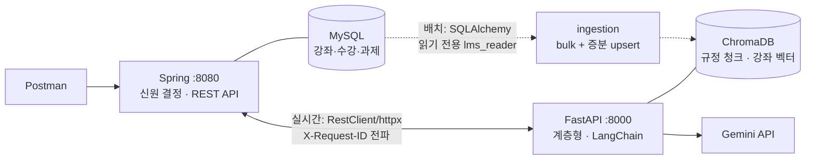

# Day 4 — 통합 프로젝트: LMS AI 학습 도우미 (최종)

> **4일간 만든 모든 부품이 하나의 제품이 되는 날.**
> Day 1의 벡터 검색, Day 2의 RAG·LangChain, Day 3의 Function Calling 루프가 **실무형 계층 구조** 안으로 이사하고, Spring(MySQL)과 로깅·예외까지 관통합니다. 테스트는 전부 Postman으로 합니다.

**최종 기능 2개** — ① RAG 기반 챗봇 `/chat` (규정 검색 + 개인 데이터 조회 + 추천을 도구 라우팅으로 통합) ② 수강 이력 기반 강의 추천 `/courses/recommend` (MySQL 이력 → 벡터 유사도 → 점수화 → LCEL 추천 이유)

---

## 먼저 읽기 — 이 프로젝트를 공부하는 순서

처음부터 모든 파일을 한 번에 이해하려고 하지 마세요. 아래 순서로 읽으면 요청의 흐름을 따라가기 쉽습니다.

1. `docs/architecture-guide.md`에서 전체 책임과 의존 방향을 확인합니다.
2. `app/main.py`에서 FastAPI 애플리케이션이 어떻게 조립되는지 봅니다.
3. `routers → schemas → services` 순서로 API 요청이 비즈니스 로직에 도달하는 과정을 읽습니다.
4. `repositories/vector_store.py`, `clients/spring_client.py`, `clients/llm.py`에서 외부 자원 접근을 확인합니다.
5. `ingestion/`에서 MySQL·PDF 데이터가 ChromaDB에 저장되는 오프라인 흐름을 확인합니다.
6. 마지막으로 `docs/api-contract.md`와 Spring DTO를 비교하며 서버 간 계약을 점검합니다.

> 코드의 긴 주석은 단순 설명이 아니라 “이 코드를 왜 이 계층에 두었는가”를 설명합니다. 실행 전에 먼저 읽고, 실행 후 로그와 응답으로 확인하세요.

---

## 1. 진행 순서 (STEP 0 → 6) — 이 순서대로만 따라오세요

```
STEP 0. MySQL 준비        mysql -u root -p < (Spring 프로젝트)/db/init.sql   ※ 최초 1번
STEP 1. Spring 실행       lms-spring-mysql 폴더에서 ./gradlew bootRun
                          → 확인: http://localhost:8080/api/students/1/courses
STEP 2. 파이썬 환경        pip install -r requirements.txt
                          Windows: copy .env.example .env
                          macOS/Linux: cp .env.example .env
                          → 생성된 .env에 GOOGLE_API_KEY 입력
STEP 3. ★ 색인 배치       python -m ingestion.run_ingest
                          → "강좌 색인: 13건", "규정 색인: 13청크" 로그 확인
STEP 4. AI 서버 실행      uvicorn app.main:app --reload --port 8000
                          → 확인: http://localhost:8000/health (counts가 0이 아니어야!)
STEP 5. Postman 검증      postman/*.json Import → 폴더 A→E 순서대로 실행
STEP 6. 증분 색인 실습    MySQL에서 UPDATE course SET description='...' WHERE code='C003';
                          python -m ingestion.run_ingest --incremental
                          → "강좌 색인: 1건 (증분)" — 바뀐 강좌만 재임베딩되는 것을 관찰!
```

STEP 3을 건너뛰면 챗봇도 추천도 빈 결과를 냅니다 — 데이터 파이프라인이 서비스보다 먼저라는 것부터가 수업 내용입니다.

---

## 2. 전체 아키텍처 — 데이터가 흐르는 길은 두 갈래



| | 온라인 경로 (요청 시) | 오프라인 경로 (색인 배치) |
|---|---|---|
| 무엇을 | "학생 1의 수강 이력" — 소량·실시간 | 강좌 카탈로그 전체 — 임베딩 재료 |
| 방법 | Spring REST API 경유 (`clients/spring_client.py`) | MySQL 직접 SELECT (`ingestion/mysql_reader.py`) |
| 왜 | 신원·비즈니스 규칙의 주인은 Spring. 실시간 조회까지 DB를 직접 만지면 규칙이 두 곳으로 흩어진다 | 대량 조회는 직접이 효율적 + Spring이 꺼져도 색인 가능. 단 **읽기 전용 계정**(`lms_reader`, SELECT만)으로 — 최소 권한 원칙 |

"AI 서버가 DB를 직접 봐도 되는가?"라는 실무 단골 논쟁의 답이 이 표입니다: 실시간은 API, 배치는 직접(읽기 전용).

---

## 3. FastAPI 계층 구조 — 협업을 위한 규칙

```
app/
├── main.py                  # 조립만 (미들웨어·라우터·예외 핸들러) — 로직 금지
├── core/                    # 횡단 관심사 — 수정 시 팀 전체 합의
│   ├── config.py            #   설정 단일 출처 + 추천 튜닝 상수
│   ├── logging.py           #   X-Request-ID (ContextVar) + 로그 형식
│   └── exceptions.py        #   예외 → 계약 응답 {"detail","request_id"}
├── schemas/                 # DTO = 계약서(docs/api-contract.md)의 코드 표현
├── routers/                 # 얇은 입출구 — 비즈니스 로직·try/except 금지
├── services/                # 비즈니스 로직
│   ├── agent_loop.py        #   ★ Day 3 수제 FC 루프의 승격판 (공용 부품)
│   ├── chat_service.py      #   도구 5개 구성 + 루프 실행
│   └── recommend_service.py #   2단계 추천 파이프라인 + LCEL 설명 체인
├── repositories/
│   └── vector_store.py      #   ChromaDB 유일 창구 — "검색만 한다, 판단 안 한다"
└── clients/
    ├── spring_client.py     #   온라인 경로 (httpx + rid 전파)
    └── llm.py               #   LLM 생성 단일 지점 (키 명시 전달!)
ingestion/                   # 오프라인 경로 — 앱과 분리된 배치 모듈
```

협업 규칙 3가지: **① 계약 우선** — `docs/api-contract.md`와 `schemas/`를 먼저 합의하면 Spring 팀·AI 팀·팀 내부가 동시에 개발할 수 있다. **② 파일 소유권** — 예시 4인 분담: A=챗봇(`chat_service`+`agent_loop`), B=추천(`recommend_service`), C=데이터(`ingestion/`+`vector_store`), D=플랫폼(`core/`+`clients/`+Postman). **③ 의존 방향 한 방향** — `routers → services → repositories/clients → core`. 역방향 import가 보이면 코드 리뷰에서 반려.

새 기능이 오면 이 순서로 자문합니다: 새 API? → schemas+routers / 새 판단·규칙? → services / 새 데이터 소스? → repositories / 새 외부 시스템? → clients / 모든 요청에 걸침? → core+미들웨어.

---

## 4. Embedding 전략 (색인의 설계도)

| | 학사규정 PDF | 강좌 카탈로그 (MySQL) |
|---|---|---|
| 문서화 | 페이지 → Recursive 청킹 (500자/겹침 50) | 1강좌 = 1문서, `"제목 - 설명"` 결합 |
| ID | `chunk_{i}` | **`course.code`** — MySQL과 ChromaDB를 잇는 유일 키 |
| 메타데이터 | `source`, `page` → "(출처: p.N)" | `code`, `title`, `category`, `level` |
| 갱신 | 규정 개정 시 전체 재색인 | **증분**: `updated_at > 마지막 색인 시각`만 upsert |

임베딩 모델은 `jhgan/ko-sroberta-multitask`(로컬·무료·한국어 특화)로 결정. Gemini 임베딩 API 대안과의 트레이드오프: API는 색인·검색 호출마다 과금되고 네트워크 의존이 생기는 대신 관리가 없다. 어느 쪽이든 절대 원칙은 하나 — **색인한 모델과 검색하는 모델은 반드시 동일**해야 한다 (다르면 서로 다른 좌표계의 점을 비교하는 꼴). 거리 함수는 cosine, RAG threshold는 0.35(실데이터로 조정 실습).

---

## 5. 추천 점수식 — 손으로 계산해 보기

실무 추천의 표준 골격인 **후보 생성 → 재정렬** 2단계입니다. 벡터 검색은 "비슷한 것"만 알고 "다음 단계"라는 개념은 모릅니다 — 그걸 아는 건 비즈니스 규칙이고, 그래서 재정렬 계층이 따로 존재합니다.

```
후보 점수 = Σ ( 유사도 × 이력 가중치 ) + 레벨업 보너스(0.15)

이력 가중치   = 1.0 (수료) / 진도율÷100 (진행 중)
레벨업 보너스 = 시드와 같은 카테고리 + 한 단계 위 레벨일 때, 후보당 1번
하드 규칙     = 이미 수강한 강좌는 무조건 제외
```

손계산 예시 (이력: Java 기초 수료=가중치 1.0, Spring 입문 85%=0.85):

```
C004 실전 REST API가 Java기초의 이웃(유사도 0.6)이자 Spring입문의 이웃(0.9)이고
     입문→중급 레벨업이라면:
     0.6×1.0 + 0.9×0.85 + 0.15 = 1.515  ← 두 시드에서 중복 등장 + 레벨업 = 1위!
C002 OOP 심화가 Java기초의 이웃(0.8)뿐이라면: 0.8×1.0 + 0.15 = 0.95
C036 Git(다른 카테고리)이 Spring입문의 이웃(0.5)이라면: 0.5×0.85 = 0.425
```

상수(`level_up_bonus`, `per_seed_candidates` 등)는 전부 `core/config.py`에 있습니다 — 값을 바꿔 추천 순위가 어떻게 변하는지 팀별로 튜닝해 보세요. 응답의 `matched_from` 필드는 "이 추천이 어느 이력에서 나왔는지"를 보여주는 설명 가능성 장치입니다.

---

## 6. 요구 기술 4종이 사는 곳

| 기술 | 위치 |
|---|---|
| LangChain | 전 계층의 부품: `bind_tools`(chat), LCEL 체인(recommend ④), `langchain-chroma`(repository), Splitter/Document(ingestion), `ChatGoogleGenerativeAI`(clients/llm) |
| RAG | `chat_service.search_regulation` 도구 — 에이전틱 RAG (threshold + 출처 표기) |
| ChromaDB | `repositories/vector_store.py` 단일 창구, 컬렉션 2개 |
| Function Calling | `services/agent_loop.py` — Day 3에서 손으로 만든 루프가 실무 부품으로 승격 |

로깅·예외 관통(X-Request-ID)은 Day 4 초기 설계 그대로: Spring(MDC+logback) ↔ FastAPI(ContextVar+Filter)가 같은 rid로 이어지고, 에러는 양쪽 모두 `{"detail","request_id"}` (계약 v1.1). Postman D1에서 `test-trace-001`로 전 구간을 grep 해보세요.

---

## 7. 자주 발생하는 에러 FAQ

**Q1. `/health`의 counts가 0이에요** → STEP 3(색인 배치) 미실행. `python -m ingestion.run_ingest`.

**Q2. 색인 배치에서 `Access denied for user 'lms_reader'`** → `db/init.sql`을 root로 실행했는지, 비밀번호가 `core/config.py`의 `mysql_url`과 일치하는지 확인. 비밀번호를 바꿨다면 `.env`에 `MYSQL_URL=mysql+pymysql://...`로 재정의할 수 있습니다.

**Q3. 추천이 502 UpstreamException이에요** → FastAPI가 Spring을 역호출하지 못하는 상태(온라인 경로). Spring 기동 여부와 `SPRING_BASE_URL` 확인. 응답의 `request_id`로 FastAPI 로그를 찾으면 정확한 원인이 있습니다.

**Q4. 추천이 404 "수강 이력이 없어…"** → 정상 동작입니다(학생 3 시나리오). Spring을 재시작해 data.sql이 다시 적재됐는지, student_id가 1인지 확인.

**Q5. `--incremental`인데 매번 전체가 색인돼요** → 최초 실행이라 `.ingest_state.json`이 없으면 전체로 전환됩니다(로그에 경고 출력). 2번째부터 증분.

**Q6. 서버 기동이 `google_api_key` 검증 오류로 실패해요** → `.env` 미생성이거나 키가 비어 있습니다. fail-fast 설계라 기동 시점에 죽는 것이 정상입니다 (`core/config.py` 주석).

---

## 8. 팀 확장 과제 (난이도순)

1. **(config)** `level_up_bonus`를 0.4로 올리면 추천 순위가 어떻게 바뀌나요? 어떤 부작용이 생길까요?
2. **(services)** `enrolled_at`을 이용해 recency 가중치(최근 이력일수록 ×1.2 같은)를 점수식에 추가해 보세요 — Spring `CourseItem` DTO에 필드 추가 → 계약서 갱신 → 점수식 수정 순서로.
3. **(agent_loop + schemas)** `ChatResponse`에 `sources`(RAG 근거 페이지)를 추가하세요. 계약 v1.3 → schemas → Spring DTO 순서로 전파.
4. **(ingestion)** 삭제 동기화: MySQL에서 지운 강좌를 Chroma에서도 제거 (`run_ingest.py` 하단 힌트).

## 9. 학생 실습 완료 체크리스트

아래 항목을 모두 확인하면 Day 4 통합 실습이 완료된 것입니다.

- Spring `8080`, FastAPI `8000`, MySQL이 모두 실행 중이다.
- `/health` 응답에서 `doc_chunks`, `courses`가 0보다 크다.
- Postman 컬렉션 A→E를 실행하고 정상·오류 응답을 모두 확인했다.
- 챗봇 질문에 따라 `used_tools`가 달라지는 이유를 설명할 수 있다.
- 추천 응답의 `score`와 `matched_from`이 어떤 과정에서 만들어지는지 설명할 수 있다.
- 동일한 `X-Request-ID`로 Spring과 FastAPI 로그를 연결해서 찾을 수 있다.
- 강좌 설명을 수정한 뒤 증분 색인에서 변경된 강좌만 처리되는 것을 확인했다.

---

## 10. 최종 체크포인트 (4일 과정 회고)

1. "출석 기준이 뭐야?"와 "다음에 뭐 듣지?"는 챗봇 내부에서 완전히 다른 경로를 탑니다. 두 경로를 Day 1~3 개념으로 설명해 보세요.
2. 같은 MySQL인데 수강 이력 조회는 Spring API로, 강좌 카탈로그는 직접 SELECT로 가져옵니다. 이 비대칭의 이유를 두 가지 관점(규칙의 주인 / 효율·권한)에서 설명해 보세요.
3. 벡터 유사도만으로는 왜 "다음 강의" 추천이 안 될까요? 점수식의 어떤 항이 그 한계를 메우나요?
